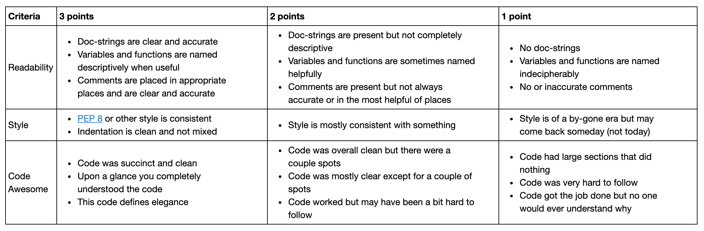

## Peer Review Guidelines
Use the following questions to guide your review. At a minimum you should provide (1) a written assessment and (2) a numeric score to each of the three questions listed below. Refer to the rubric for a guide to scoring. 

Wherever possible include line numbers and specific pointers. Remember the goal is not just to point out areas that could be improved but to provide your partner ideas for how to do better. For example you might suggest:
- Clever ways to use built-in functionality (when appropriate)
- Simpler ways to implement the same functionality
- General improvements to structure, style, and naming

And of course remember to always be courteous to the person you are reviewing!

### Questions to consider
1. Is the script easy to read and understand?
 - Are variables and functions named descriptively when useful?
 - Are the comments helpful?
 - Can you run the script on your own easily?
 - Are the doc-strings useful?

2. Does the code follow PEP8 style consistently?
 - If not are there specific instances where the script diverges from this style?

3. Is the code written succinctly and efficiently?
 - Are there superfluous code sections?
 - Is the use of functions appropriate?
 - Is the code written elegantly without decreasing readability?

### Rubric
(Adapted from Kyle Mandli [Intro to Numerical Methods](https://github.com/mandli/intro-numerical-methods))

