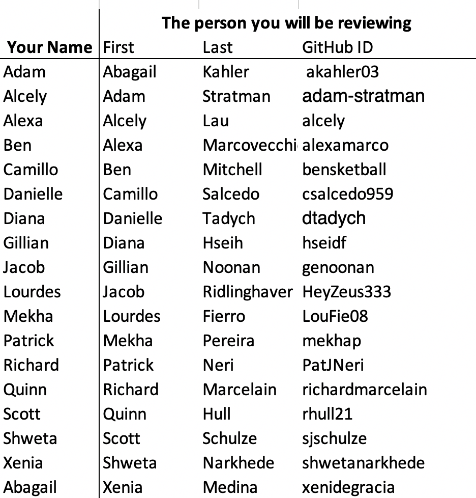

# Week 7: Python skills week 5
This week we are going to be working on making our code cleaner and easier to interpret.
____
## Table of Contents:
1. [ To Do List](#todo)
1. [ Setup Intructions](#setup)
1. [ Resources](#resources)
1. [ Training Activities](#training)
1. [ Forecast Assignment](#assignment)
1. [ Code Review Partners](#partners)
___

## To Do List
1. Setup linting in VSCode following the [setup](#setup) instructions. If possible test this out **before class on Thursday** so you can get help if needed.  

1. Revise **your code** by **Friday at Midnight** following [Part 1 of the forecast assignment](#assignment) instructions. Submitting a script and a ReadMe that your partner can generate a forecast from is worth 3 points.   

2. After part 1 has been completed (i.e starting Saturday morning) **review your partners code and run their forecast**. You will submit your code evaluation and your partner's forecast by **noon on Monday**. See [Part 2 of the Forecast Assignment](#assignment) for more details. Your evaluation is worth 4 points.

**NOTE**: You will **not** be submitting your own forecast this week. Whoever is running your script will be submitting it for you. You will be scored based on the forecast they submit on your behalf.

___

## Setup Instructions

Linters are tools that check the format of your code. In this case we will use the Flake8 tool to check our codes for PEP8 compliance. This is just one choice. There are lots of different tools you can use for this.

1. Access your command pallet in VS Code:
`Ctrl+Shift+P`(windows) `Cmd+Shift+P` (mac)
2. Type `Python: Select Linter` and choose `Flake8` from the dropdown menu
3. You will likely be prompted to install this at this point say yes and choose `conda` if it asks whether you want to install with pip or conda.
4. Next go back to your command pallet the same way you did at the start and type `Python: Enable Linting` and turn your linter on.
5. Now if you save changes to your file the linter should run automatically. If it's working, you will see red underlines where there are PEP8 issues in the code. Also you will see numbers appear in the bottom bar of your window noting how many issues you have (in this case 26 errors and 11 warnings)

6. You can click on the warnings in the bottom bar and this will bring up a detailed list of problems you can check out like this:

You can click on these items to be taken to the place in the code where they appear. If you fix issues and re-save your file you should see the errors you just fixed disappear from your list.
- **Note**: You can also run your linter any time by typing `Python: Run Linting` from the command pallet.
- For more info on  linting in VSCode check out this [link](https://code.visualstudio.com/docs/python/linting).

___

## References
- [Pep 8 Style Guide for Python Code](https://www.python.org/dev/peps/pep-0008/)
- [Tutorial on Python Functions](https://365datascience.com/python-functions/)

___

## Required Training Activities
1. Chapter 16 of Intro to Earth Data Science
  - [Lesson 1](https://www.earthdatascience.org/courses/intro-to-earth-data-science/write-efficient-python-code/intro-to-clean-code/): Introduction to Writing Clean Code and Literate Expressive Programming
  - [Lesson 2](https://www.earthdatascience.org/courses/intro-to-earth-data-science/write-efficient-python-code/intro-to-clean-code/python-pep-8-style-guide/): Introduction to PEP 8 Style Guide
  - [Lesson 3](https://www.earthdatascience.org/courses/intro-to-earth-data-science/write-efficient-python-code/intro-to-clean-code/expressive-variable-names-make-code-easier-to-read/): Writing expressive code
  - [Lesson  4](https://www.earthdatascience.org/courses/intro-to-earth-data-science/write-efficient-python-code/intro-to-clean-code/dry-modular-code/): Writing modular code

1. Chapter 19 of Intro to Earth Data Science
    - [Lesson 1](https://www.earthdatascience.org/courses/intro-to-earth-data-science/write-efficient-python-code/functions-modular-code/): Introduction to functions
    - [Lesson  2](https://www.earthdatascience.org/courses/intro-to-earth-data-science/write-efficient-python-code/functions-modular-code/write-functions-in-python/): Writing functions in python.
    - [Lesson 3](https://www.earthdatascience.org/courses/intro-to-earth-data-science/write-efficient-python-code/functions-modular-code/write-functions-with-multiple-and-optional-parameters-in-python/): Writing multi-parameter functions
___

## Assignment 7: Making our scripts nice!
This week we will be working from the script you submitted for assignment 6 and cleaning it up so that someone else can run it and submit your forecast for you. Note that you will not be submitted a md written assignment this week. Your written assignment will be the code review you complete in part 2 of the assignment.

#### Forecast Rules for this week:
- You must use the pandas dataframe *data* created as the basis for your analysis.

- You can do any mathematical operation using numpy or pandas package to do so and you can use LinearRegression models from the sklearn package.  

- The only dataset you can use is the historical observed streamflow (Station 09506000 Verde River Near Camp Verde, refer to previous weeks for download instructions if needed. )

- You can use the streamflow data up to the Saturday before the forecast is due for making your decisions.

#### Assignment Part 1 (Due Friday Midnight, 3 points):
For the first part of the assignment this week you will be revising the code you submitted for the previous assignment to make it easier to read and so that someone else will be able to run your forecast.  You should refer to the evaluation rubric in the starter code folder for complete details on how your script will be evaluated in peer review.

**Your script must be able to do the following:**
  - Generate 1 and 2 week forecasts using an autoregressive model.
  - Generate the 1 and 2 week forecasts you would like to enter into the forecast competition. This can be the same as your regression model if you would like or it can be different.
  - Note: This week we won't do long term forecasts so you can  skip that part. In other words your script just needs to be able to generate 4 numbers.
  - It **must include at least 1 function**
  - Using only the script and any instructions you provide in the ReadMe file your partner must be able to generate your forecast without any other contact with you.

**You should consider the following in your code revisions:**
  - Are you following pep8 standards?
  - Is your code well commented and easy for someone else to follow?
  - Do you have docstrings for your functions?
  - Are all of your paths setup as relative paths so that your partner can run your script from the submission folder you create?
  - Are your variables well defined?
  - Is your code as efficient as it can be?

**What to submit for Part 1**
- In your `submission` folder create a directory called `Code_Review1`.
- Put your final python script in this folder named `LastName_HW7.py`
- Double check before you submit that the script can run directly from this folder and that you have the path to your data and functions setup correctly so that your peer review partner can run it without making any adjustments
- Add a file called `ReadMe.md` that includes instructions you would like your partner to follow to run your script and generate your forecast.
- Include spaces in your `ReadMe.md` file for your partner to enter:
 - Your 1 and 2 week forecast submission values
 - Your regression based 1 and 2 week forecasts
 - Your code review following the rubric

#### Assignment Part 2 (Due Monday at Noon, 4 points):
For the second part of this assignment you will be working in your partners repo. You can start this part on Saturday morning after they have submitted their revised script.

1. First check below to see who your partner is.

2. Clone their repo to your computer. You can find their repo by going to the [main GitHub organization page](https://github.com/HAS-Tools-Fall2020) for this class.

3. Review their code following the `code_review_rubric.md` instructions in the `starter_codes` folder. You should provide your comments and scores in the spaces they have provided for you in their `ReadMe.md` file  in the `Code_Review1` folder of their GitHub `submissions` folder.  

4. Follow the instructions they have provided in their `ReadMe.md` file to run their script and generate their 4 forecast values.

5. Enter all four values (the two regression forecasts and the two forecast values into the `ReadMe.md` file of your partners repo.

6. Enter the two forecast values into the `lastname.csv` file **for your partner**. Remember you are entering their forecast for them this week, not your own!

**Note**: Unless your partner fails to submit a working script by Friday, if you don't get your partners forecast submitted in time any points that you are awarded this week in the forecast competition will be transferred to your partner.

___

## Code Review Partners

